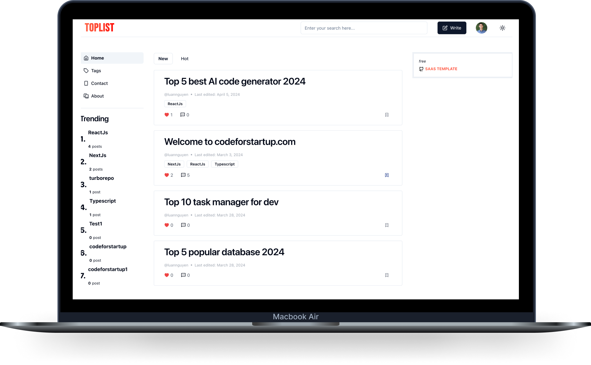

<p align="center">
    <a href="https://codeforstartup.com/">
        
        <h1 align="center" style="color: red">NEXT FORUM</h1>
    </a>
</p>

# About next-forum

# Installation

Install

```
turbo install
```

In the `apps/web` folder, copy the env.example to env.local and enter the environment values

In the `packages/database`, copy the env.example to .env and enter the DATABASE_URL

Migration

```
db:migrate
```

Start

```
turbo dev
```

# Libraries

🤖 ReactJS  
🎯 TypeScript  
💫 NextJS 14 - App router and server actions  
🐧 next-auth  
🤗 Prisma ORM  
🎭 Postgres  
🚀 Turborepo  
🎯 TailwindCSS  
🔥 shadcn  
💌 next-themes  
🖋 Zod validation  
🎰 React Form Hook  
️🥇 Tsup  
💒 EditorJs  
🐢 react-toastify  
🍾 react-textarea-autosize  
🐠 lucide-react icon  
🐴 dayjs  
🤗 Eslint  
💥 Husky  
👽 Prettier

# Functions

## Front side functions

- [x] Register by email or github
- [x] Login by email, github or magic link
- [x] User logout
- [x] CRUD post
- [x] List post: Search & filter by top or hot week, month, year, infinity
- [x] Like post
- [x] Comment on post
- [x] Share post
- [x] Manage tag
- [x] Follow user
- [x] Multiple theme & dark mode or light mode
- [x] Multiple language
- [x] Follow tag
- [x] Manage user profile
- [ ] Multiple type: post/question

## Admin functions

- [x] Dashboard
- [x] CRUD tags
- [ ] CRUD users
- [ ] Manage posts
- [ ] Manage images
- [ ] Settings: Header/Menu

# DEV NOTES

[[1][DEV NOTE] Initial turbo project and add tailwindcss library](https://dev.to/codeforstartup/dev-note-initial-turbo-project-and-add-tailwindcss-library-4iae)  
[[2][DEV NOTE] Integrate prisma and postgres database](https://dev.to/codeforstartup/2dev-note-add-prisma-and-postgres-database-2m84)  
[[3][DEV NOTE] Create a form with tiptap and react-textarea-autosize](https://dev.to/codeforstartup/3dev-note-create-a-form-with-tiptap-and-react-textarea-autosize-1cgn)
